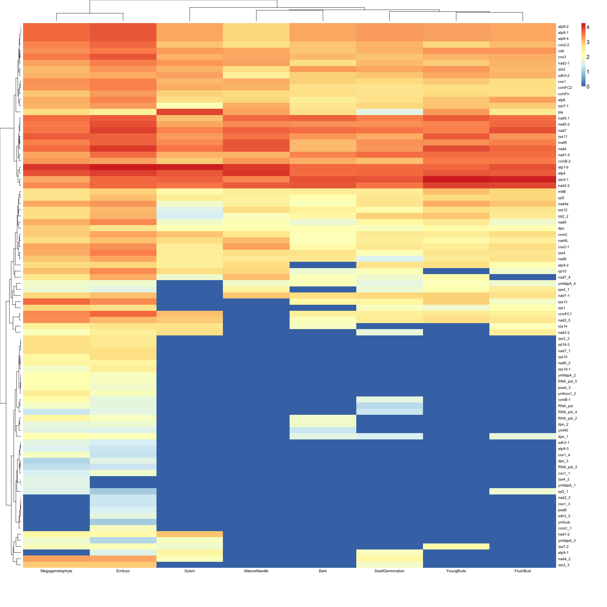

# Organellar Genomes of White Spruce (*Picea glauca*): Assembly and Annotation

Shaun D Jackman, Anthony Raymond, Ben Vandervalk, Hamid Mohamadi, Rene Warren,
Stephen Pleasance, Robin Coope, Macaire MS Yuen, Christopher Keeling, Carol
Ritland, Jean Bousquet, Alvin Yanchuk, Kermit Ritland, John MacKay, Steven JM
Jones, Joerg C Bohlmann, Inanc Birol

# Abstract

The genome sequences of the plastid and mitochondrion of white spruce (*Picea
glauca*) are assembled from whole genome Illumina sequencing data using ABySS.
Whole genome sequencing data contains reads from both the nuclear and organellar
genomes. Reads of the organellar genomes are abundant, because each cell
contains hundreds of mitochondria and plastids. One lane of MiSeq data assembles
the 123 kbp plastid genome in a single contig, and one lane of HiSeq data
assembles a putative 5.9 Mbp mitochondrial genome. The raw assembly is expected
to be composed of organellar sequence as well as nuclear repeat elements. The
organellar sequences are separated from the assembly by classifying the
sequences using their length, depth of coverage and GC content. The genes and
repeats of the plastid and mitochondrial genomes are annotated using MAKER-P.

Introduction
============

Plant cells contain two organelles located in the cytoplasm that harbour their
own genomes, the mitochondrion and the plastid (chloroplast). It can be
difficult to infer phylogenetic trees from nuclear genes of polyploid species
"with large genomes and complex gene families, such as gymnosperms" (Yang et al.
[2012](#ref-yang2012three)). Non-coding regions of plastid DNA (cpDNA) have
secondary RNA structures with regions that are highly variable in gymnosperm
that make it suitable for phylogenetic inference (Hao et al.
[2010](#ref-hao2010sequence)).

Mitochondrial genomes are inherited maternally from seeds in *Pinaceae*, and
plastid genomes are inherited paternally from pollen (Whittle & Johnston
[2002](#ref-whittle2002male)). These contrasting inheritance schemes can be
useful in phylogenetic comparisons of species expanding their range. In the case
of two previously allopatric species now found in sympatry, the mitochondrial
DNA (mtDNA) is contributed by the resident species, whereas introgression of the
plastid genome into the expanding species is limited, since pollen is more
readily dispersed than seeds (Du et al. [2011](#ref-du2011direction)).
Differential gene flow of cpDNA and mtDNA due to different methods of
inheritance and dispersion results in new assemblages of organellar genomes and
an increase of genetic diversity after expansion from a refugium (Gerardi et al.
[2010](#ref-gerardi2010glacial)).

Analysis of cpDNA is useful in reconstructing phylogenetic trees of diverse
plant species (Wu et al. [2007](#ref-wu2007chloroplast)), in determining the
origin of an expanding population (Aizawa et al.
[2012](#ref-aizawa2012phylogeography)) and in determining when distinct lineages
of a species resulted from multiple colonization events (Jardón-Barbolla et al.
[2011](#ref-jardon2011phylogeography)).

The complete plastid genomes of the gymnosperms *Podocarpus lambertii*, *Taxus
chinensis* var. *mairei* and four *Juniperus* species were submitted to NCBI
GenBank in 2014 (Nascimento Vieira, Faoro, Rogalski, et al.
[2014](#ref-do2014complete); Zhang et al. [2014](#ref-zhang2014complete); Guo et
al. [2014](#ref-guo2014predominant)). These projects used a variety of
strategies for isolating cpDNA either in the lab or computationally, sequencing
and assembly. The *P. lambertii* genome assembly isolated the cpDNA using the
protocol of Nascimento Vieira, Faoro, Freitas Fraga, et al.
([2014](#ref-do2014improved)), Illumina MiSeq sequencing and Newbler to assemble
the reads. The *Juniperus bermudiana* genome assembly used long-range PCR to
amplify the plastid DNA, a combination of Illumina GAII and Sanger sequencing,
and Geneious to assemble the reads using *C. japonica* as a reference genome.
The other three *Juniperus* genome assemblies used Illumina MiSeq sequencing and
Velvet (Zerbino & Birney [2008](#ref-zerbino2008velvet)) to assemble the reads.
The *T. chinensis* genome assembly used whole-genome Illumina HiSeq 2000
sequencing, BLAT (Kent [2002](#ref-kent2002blat)) to isolate the cpDNA reads and
SOAPdenovo (Luo et al. [2012](#ref-luo2012soapdenovo2)) to assemble the isolated
cpDNA reads. All of these projects used DOGMA (Wyman et al.
[2004](#ref-wyman2004automatic)) to annotate the assembly.

Only one complete mitochondrial genome of a gymnosperm has been published,
*Cycas taitungensis* (Chaw et al. [2008](#ref-chaw2008mitochondrial)). In 2014
the complete mitochondrial genomes of the spermatophytes *Brassica maritima*,
*Brassica oleracea*, *Capsicum annuum*, *Eruca sativa*, *Helianthus tuberosus*,
*Raphanus sativus*, *Rhazya stricta* and *Vaccinium macrocarpon* were submitted
to NCBI Genbank (Grewe et al. [2014](#ref-grewe2014comparative); Jo et al.
[2014](#ref-jo2014extensive); Wang et al. [2014](#ref-wang2014complete); Bock et
al. [2014](#ref-bock2014genome); Jeong et al. [2014](#ref-jeong2014complete);
Park et al. [2014](#ref-park2014complete); Fajardo et al.
[2014](#ref-fajardo2014american)). Six of these projects gave details of the
sample preparation, sequencing, assembly and annotation strategy. Three projects
enriched for organelle DNA using varying laboratory methods (Keren et al.
[2009](#ref-keren2009atnmat2); Kim et al. [2007](#ref-kim2007isolation); Chen et
al. [2011](#ref-chen2011substoichiometrically)), and the remainder used total
genomic DNA. Three projects used Illumina HiSeq 2000 sequencing and Velvet for
assembly, and three projects used Roche 454 GS-FLX sequencing and Newbler for
assembly. Most projects used an aligner such as BLAST (Altschul et al.
[1990](#ref-altschul1990basic)) to isolate sequences with similarity to known
mitochondrial sequence, either before or after assembly. Two projects used
Mitofy (Alverson et al. [2010](#ref-alverson2010insights)) to annotate the
genome, and the remainder used a collection of tools such as BLAST, tRNAscan-SE
(Lowe & Eddy [1997](#ref-lowe1997trnascan)) and ORF Finder to annotate genes.

Three further spcecies are of note for the large size of their mitochondrial
genomes. The mitochondrial genome of *Amborella trichopoda* is 3.9 Mbp, and
additionally "it is the single sister species to all other extant angiosperms"
(Rice et al. [2013](#ref-rice2013horizontal)). The mitochondrial genomes of
*Silene noctiflora* and *Silene conica* are 6.7 Mbp and 11.3 Mbp respecitvely
(Sloan et al. [2012](#ref-sloan2012rapid)).

The SMarTForests project published the draft genome sequence of the 20 gigabase
white spruce (*Picea glauca*) genome (Birol et al.
[2013](#ref-birol2013assembling)), seven times the size of the human genome,
sequenced using the Illumina HiSeq and MiSeq sequencing platforms. Whole genome
sequencing data contains reads originating from both the nuclear and organellar
genomes. Whereas one copy of the diploid nuclear genome is found in each cell,
hundreds of organelles are present, and thus hundreds of copies of the
organellar genomes. This abundance results in an overrepresentation of the
organellar genomes in whole genome sequencing data.

Assembling a single lane of whole genome sequencing data using ABySS (Simpson et
al. [2009](#ref-simpson2009abyss)) yields an assembly composed of organellar
sequences and nuclear repeat elements. The assembled sequences that originate
from the organellar genomes are separated from those of nuclear origin by
classifying the sequences using their length, depth of coverage and GC content.
The organellar genomes of white spruce are compared to those of Norway spruce
(*Picea abies*) (Nystedt et al. [2013](#ref-nystedt2013norway)).

Methods
=======

Genomic DNA was collected from the apical shoot tissues of a single white spruce
tree and sequencing libraries were constructed from that DNA as described in
Birol et al. ([2013](#ref-birol2013assembling)). Because the original intention
of this sequencing project was to assemble the nuclear genome of white spruce,
an organelle exclusion method was used to preferentially extract nuclear DNA.
Even so sequencing reads from both organellar genomes were present in sufficient
depth to assemble both genomes.

RNA was extracted from eight tissues, megagametophyte, embryo, seedling, young
buds, xylem, mature needles, flushing buds and bark, and sequenced with the
Illumina HiSeq 2000 as described in René L Warren et al.
([2015](#ref-warren2015improved)). The RNA-seq data was used to quantify the
transcript abundance of the annotated mitochondrial genes using Salmon (Patro et
al. [2014](#ref-patro2014sailfish)).

The software used in this analysis, their versions and the digital object
identifiers (DOI) of their respective publications are listed in supplementary
Table S1.

Plastid
-------

The overlapping paired-end reads were merged using ABySS-mergepairs. These
merged reads were assembled using ABySS. Contigs that are putatively derived
from the plastid were separated by length and depth of coverage using thresholds
chosen by inspection (see supplementary Figure S1). These putative plastid
contigs were assembled into scaffolds using ABySS-scaffold.

We ran the gap-filling application Sealer (Paulino et al., in review; options
`-v -j 12 -b 30G -B 300 -F 700` with `-k` from 18 to 108 with step size 6) on
the ABySS assembly of the plastid genome, closing 5 of the remaining 7 gaps,
with a resulting assembly consisting of two large (~50 and ~70 kbp) scaftigs.
Given the small size of the plastid genome (123 kbp), we opted to manually
finish the assembly using Consed 20.0 (Gordon & Green
[2013](#ref-gordon2013consed)). Briefly, we loaded the resulting gap-filled
assembly into Consed and imported Pacific Biosciences (PacBio) (**data
description NEEDED XX**) 9204 reads 500 bp and larger into the assembly and
aligned them to the plastid genome using cross\_match (Green
[1999](#ref-green1999documentation)) from within Consed. For each scaftig end, 6
PacBio reads were pulled out and assembled using the mini-assembly feature in
Consed. Cross\_match alignments of the resulting contigs to the plastid assembly
were used to merge the two scaftigs and confirm that the complete circular
genome sequence was obtained. In a subsequent step, 7,742 Illumina HiSeq reads
were imported and aligned to the assembly following the same same procedure as
above. We used this limited set of 7,742 HiSeq reads to make finishing more
manageable. These reads were selected on the basis of BWA 0.7.5a (Li
[2013](#ref-li2013aligning)) alignment to our draft plastid genome, focusing on
regions that would benefit from read import by restricting our search using
samtools 0.1.18 to regions with ambiguity and regions covered by PacBio reads
exclusively. As described for the PacBio data, subset of Illumina reads were
pulled out, mini-assembled with Phrap and the resulting contigs re-merged to
correct bases in gaps filled only by PacBio, namely one gap and sequence at
edges confirming the circular topology. The starting base was chosen using the
Norway spruce plastid genome sequence (NC\_021456 Nystedt et al.
[2013](#ref-nystedt2013norway)). Our assembly was further polished using the
Genome Analysis Toolkit (GATK) 2.8-1-g932cd3a FastaAlternateReferenceMaker
(McKenna et al. [2010](#ref-mckenna2010genome)).

The assembled plastid genome was initially annotated using DOGMA, but DOGMA is
an interactive web application, which is not convenient for an automated
pipeline. We instead used MAKER (Campbell et al. [2014](#ref-campbell2014maker))
for annotation, which is intended for automated pipelines, and used the Norway
spruce complete plastid genome (NC\_021456 Nystedt et al.
[2013](#ref-nystedt2013norway)) for both protein-coding and non-coding gene
homology evidence. The parameters of MAKER are show in supplementary Table S2.
The inverted repeat was identified using MUMmer (Kurtz et al.
[2004](#ref-kurtz2004versatile)), shown in supplementary Figure S3.

The assembled plastid genome was aligned to the Norway spruce plastid using
BWA-MEM (Li [2013](#ref-li2013aligning)). Coverage and identity of these
alignments were calculated using the script `bam-identity` (see supplementary
materials). The two genomes were compared using QUAST (Gurevich et al.
[2013](#ref-gurevich2013quast)) to confirm the presence of the annotated genes
of the Norway spruce plastid in the white spruce plastid.

Mitochondrion
-------------

ABySS-konnector was used to fill the gap between the paired-end reads of a
single lane of Illumina HiSeq sequencing of a paired-end library. These
connected paired-end reads were assembled using ABySS. Putative mitochondrial
sequences were separated from the assembly by their length, depth of coverage
and GC content using k-means clustering in R (see supplementary Figure S2).
These putative mitochondrial contigs were then assembled into scaffolds using
ABySS-scaffold with a single lane of Illumina HiSeq sequencing of a mate-pair
library.

The white spruce mitochondrial genome was assembled as described above,
resulting in 71 scaffolds. We ran the gap-filling application Sealer attempting
to close the gap between every possible combination of two scaffolds. This
approach closed 10 gaps and yielded 61 scaffolds, which we used as input to the
LINKS scaffolder 1.1 (Rene L Warren et al. [2015](#ref-warren2015links))
(options `-k 15 -t 1 -l 3 -r 0.4`, 19 iterations with `–d` from 500 to 6000 with
step size 250) in conjunction with long PacBio reads, further decreasing the
number of scaffolds to 58. White spruce PG29 Konnector pseudoreads were aligned
to the 58 LINKS scaffolds with BWA 0.7.5a (`bwa mem -a multimap`), and we
created links between two scaffolds when reads aligned within 1000 bp of the
edges of any two scaffolds. Alignments were not necessarily split, nor primary.
In some cases, the primary alignment was buried in a large scaffold, but
secondary alignments suggested redundant sequences flanking a scaffold pair. We
modified LINKS to read the resulting SAM alignment file and link scaffolds
satisfying this criteria (options `LINKS-sam -e 0.9 -a 0.5`), bringing the final
number of scaffolds to 38. We confirmed the merges using mate-pair reads. The
white spruce mate-pair libraries used for confirmation are presented in Birol et
al. ([2013](#ref-birol2013assembling)) and available from DNAnexus (SRP014489
<http://sra.dnanexus.com/studies/SRP014489>). In brief, mate-pair reads from
three fragment size libraries (5, 8 and 12 kbp) were aligned to the 38-scaffold
assembly with BWA-MEM 0.7.10-r789 and the resulting alignments parsed with a
PERL script. A summary of this validation is presented in supplemental Table S4.
Automated gap-closing was performed with Sealer 1.0 (options
`-j 12 -B 1000 -F 700 -P10 -k96 -k80`) using Bloom filters built from the entire
white spruce PG29 read data set (René L Warren et al.
[2015](#ref-warren2015improved)) and closed 55 of the 182 total gaps (30.2%). We
polished the gap-filled assembly using GATK and a single HiSeq white spruce
sequence lane (**XX NEEDED SRA ID**), as described for the plastid genome.

The assembled scaffolds were aligned to the NCBI nucleotide (nt) database using
BLAST to check for hits to mitochondrial genomes and to screen for
contamination.

The mitochondrial genome was annotated using MAKER (parameters shown in
supplementary Table S3). The proteins of all green plants (*Viridiplantae*) with
complete mitochondrial genome sequences in NCBI GenBank, 51 species, were used
for protein homology evidence and aligned using BLAST and Exonerate (Slater &
Birney [2005](#ref-slater2005automated)). The prince sago palm (*Cycas
taitungensis*) mitochondrion (NC\_010303 Chaw et al.
[2008](#ref-chaw2008mitochondrial)) is the closest related species, being the
only gymnosperm with a complete mitochondrial genome. Transfer RNA (tRNA) were
annotated using ARAGORN (Laslett & Canback [2004](#ref-laslett2004aragorn)).
Ribosomal RNA (rRNA) were annotated using RNAmmer (Lagesen et al.
[2007](#ref-lagesen2007rnammer)). Repeats were identified using RepeatMasker
(Smit et al. [1996](#ref-smit1996repeatmasker)) and RepeatModeler.

The putative mitochondrial sequences of white spruce were aligned to the
putative mitochondrial sequences of the Norway spruce using BWA-MEM. Coverage
and identity of these alignments were calculated using the script `bam-identity`
(see supplementary materials).

Results
=======

The assembly and annotation metrics are summarized in Table 1.

<table>
<caption>Sequencing, assembly and alignment metrics of the white spruce organellar genomes. The number of distinct genes are shown in parentheses.</caption>
<thead>
<tr class="header">
<th align="left">Metric</th>
<th align="left">Plastid</th>
<th align="left">Mitochondrion</th>
</tr>
</thead>
<tbody>
<tr class="odd">
<td align="left">Number of lanes</td>
<td align="left">1 MiSeq lane</td>
<td align="left">1 HiSeq lane</td>
</tr>
<tr class="even">
<td align="left">Number of read pairs</td>
<td align="left">4.7 million</td>
<td align="left">133 million</td>
</tr>
<tr class="odd">
<td align="left">Read length</td>
<td align="left">300 bp</td>
<td align="left">150 bp</td>
</tr>
<tr class="even">
<td align="left">Number of merged reads</td>
<td align="left">3.0 million</td>
<td align="left">1.4 million</td>
</tr>
<tr class="odd">
<td align="left">Median merged read length</td>
<td align="left">492 bp</td>
<td align="left">465 bp</td>
</tr>
<tr class="even">
<td align="left">Number of assembled reads</td>
<td align="left">21 thousand</td>
<td align="left">377 thousand</td>
</tr>
<tr class="odd">
<td align="left">Proportion of organellar reads</td>
<td align="left">1/140 or 0.7%</td>
<td align="left">1/350 or 0.3%</td>
</tr>
<tr class="even">
<td align="left">Depth of coverage</td>
<td align="left">80x</td>
<td align="left">30x</td>
</tr>
<tr class="odd">
<td align="left">Assembled genome size</td>
<td align="left">123,266 bp</td>
<td align="left">5.94 Mbp</td>
</tr>
<tr class="even">
<td align="left">Number of contigs</td>
<td align="left">1 contig</td>
<td align="left">132 contigs</td>
</tr>
<tr class="odd">
<td align="left">Contig N50</td>
<td align="left">123 kbp</td>
<td align="left">102 kbp</td>
</tr>
<tr class="even">
<td align="left">Number of scaffolds</td>
<td align="left">1 scaffold</td>
<td align="left">38 scaffolds</td>
</tr>
<tr class="odd">
<td align="left">Scaffold N50</td>
<td align="left">123 kbp</td>
<td align="left">369 kbp</td>
</tr>
<tr class="even">
<td align="left">Largest scaffold</td>
<td align="left">123 kbp</td>
<td align="left">1222 kbp</td>
</tr>
<tr class="odd">
<td align="left">GC content</td>
<td align="left">38.8%</td>
<td align="left">44.7%</td>
</tr>
<tr class="even">
<td align="left">Number of genes without ORFs</td>
<td align="left">114</td>
<td align="left">155</td>
</tr>
<tr class="odd">
<td align="left">Protein coding genes (mRNA)</td>
<td align="left">74 (72)</td>
<td align="left">101 (50)</td>
</tr>
<tr class="even">
<td align="left">Ribosomal RNA genes (rRNA)</td>
<td align="left">4 (4)</td>
<td align="left">8 (3)</td>
</tr>
<tr class="odd">
<td align="left">Transfer RNA genes (tRNA)</td>
<td align="left">36 (32)</td>
<td align="left">46 (29)</td>
</tr>
<tr class="even">
<td align="left">Open reading frames (ORF)  ≥  300 bp</td>
<td align="left">NA</td>
<td align="left">1047</td>
</tr>
<tr class="odd">
<td align="left">Coding genes containing introns</td>
<td align="left">8</td>
<td align="left">13</td>
</tr>
<tr class="even">
<td align="left">Introns in coding genes</td>
<td align="left">9</td>
<td align="left">17</td>
</tr>
<tr class="odd">
<td align="left">tRNA genes containing introns</td>
<td align="left">6</td>
<td align="left">16</td>
</tr>
<tr class="even">
<td align="left">Identity to Norway spruce</td>
<td align="left">99.2%</td>
<td align="left">98.3%</td>
</tr>
<tr class="odd">
<td align="left">Coverage of Norway spruce</td>
<td align="left">99.7%</td>
<td align="left">59.6%</td>
</tr>
</tbody>
</table>

Plastid
-------

The plastid genome was assembled into a single circular contig of 123,266 bp.
The assembly metrics are shown in Table 1. The plastid genome contains 114
genes: 74 protein coding (mRNA) genes, 36 transfer RNA (tRNA) genes and 4
ribosomal RNA (rRNA) genes, shown in Figure 1, which is rendered using OGDRAW
(Lohse et al. [2007](#ref-lohse2007organellargenomedraw)) and Circos (Krzywinski
et al. [2009](#ref-krzywinski2009circos)).

All protein-coding genes are single copy, except *psbI* and *ycf12*, which have
two copies each. All tRNA genes are single copy, except *trnH-GUG*, *trnI-CAU*,
*trnS-GCU* and *trnT-GGU*, which have two copies each. All rRNA genes are single
copy.

The protein-coding genes *atpF*, *petB*, *petD*, *rpl2*, *rpl16*, *rpoC1* and
*rps12* each contain one intron, and *ycf3* contains two introns. The tRNA genes
*trnA-UGC*, *trnG-GCC*, *trnI-GAU*, *trnK-UUU*, *trnL-UAA* and *trnV-UAC* each
contain one intron. The rRNA genes are not spliced.

The first and smallest exons of the genes *petB*, *petD* and *rpl16* are 6, 8
and 9 bp respectively. These genes likely belong to polycistronic transcripts
(Barkan [1988](#ref-barkan1988proteins)) of their respective protein complexes,
but the short size of their initial exons make them difficult to annotate all
the same. The initial exons of these genes were added to their annotations
manually.

The gene *rps12* of a plastid genome is typically trans-spliced (Hildebrand et
al. [1988](#ref-hildebrand1988trans)), which makes it difficult to annotate
using MAKER. It is composed of three exons and one cis-spliced intron. It
required manually editing the gene annotation to incorporate trans-splicing in
the gene model.

Each copy of the inverted repeat (IR) is 445 bp in size, much smaller than most
plants, but typical of *Pinaceae* (Lin et al. [2010](#ref-lin2010comparative)).
Unlike most inverted repeats, which are typically identical, the two copies
differ by a single base. The IR contains a single gene, the tRNA *trnI-CAU*.

All 114 genes of the Norway spruce plastid genome are present in the white
spruce plastid genome. The genomes of the white spruce plastid and Norway spruce
plastid show perfect gene synteny with no structural rearrangements.

Mitochondrion
-------------

The mitochondrial genome was assembled into 38 scaffolds (132 contigs) with a
scaffold N50 of 369 kbp (contig N50 of 102 kbp). The largest scaffold is 1222
kbp. The assembly metrics are shown in Table 1.

The scaffolds were aligned to the NCBI nucleotide (nt) database using BLAST. Of
the 38 scaffolds, 26 scaffolds align to mitochondrial genomes, 3 small scaffolds
(&lt;10 kbp) align to *Picea glauca* mRNA clones and BAC sequences, 7 small
scaffolds (&lt;10 kbp) had no significant hits, and 2 small scaffolds (&lt;5
kbp) align to cloning vectors. These last two scaffolds were removed from the
assembly.

The mitochondrial genome contains 101 protein coding (mRNA) genes, 46 transfer
RNA (tRNA) genes and 8 ribosomal RNA (rRNA) genes, shown in Figure 2. The coding
genes compose 72 kbp (1.2%) of the genome, shown in Figure 3. The 101
protein-coding genes encode 50 distinct genes. The 46 tRNA genes are found in 29
distinct species for 18 amino acids.

A large number of open reading frames are identified: 5702 at least 90 bp,
composing 1.3 Mbp, and 1047 at least 300 bp, composing 407 kbp. These open
reading frames have no significant sequence similarity to any gene annotated in
the 51 species of *Viridiplantae* mitochondria with complete genomes.

A total of 17 introns are found in 13 distinct protein-coding genes. The
protein-coding genes *atp8*, *cox1*, *matR*, *nad2*, *nad7*, *rpl10*, *rps1*,
*rps2* and *rps4* each contain one intron, and *ccmFn*, *nad4*, *nad5* and
*rps3-1* each contain two introns.

A total of 16 introns are found in 12 distinct species of tRNA. The tRNA genes
*trnD-AUC*, *trnH-GUG*, *trnL-UAG*, *trnN-AUU*, *trnP-AGG*, *trnR-GCG*,
*trnR-UCG*, *trnS-GCU*, *trnS-GGA*, *trnU-UCA*, *trnV-CAC* and *trnV-UAC*
contain introns.

Repeats compose 386 kbp (6.4%) of the mitochondrial genome. Simple repeats and
LTR Copia, ERV1 and Gypsy are the most common repeats, shown in Figure 4.

The transcript abundance of the mitochondrial coding genes with known function
is shown in Figure 5. The two developmental tissues megagametophyte and embryo
have the highest overall gene expression and cluster together.

The putative mitochondrial sequences of white spruce and Norway spruce show high
sequence similarity, over 98% nucleotide identity, but only 60% of the Norway
spruce putative mitochondrial sequences are covered by alignments of the white
spruce sequences.

Conclusion
==========

One lane of MiSeq sequencing of whole genome DNA is sufficient to assemble the
123 kbp complete plastid genome, and one lane of HiSeq sequencing of whole
genome DNA is sufficient to assemble a draft 5.9 Mbp mitochondrial genome of
white spruce. Scaffold contiguity is improved with additional mate-pair library
sequencing. The resulting assembly of whole genome sequencing data is composed
of organellar sequences as well as high-copy-number nuclear repeat elements. The
mitochondrial sequences are separated using a k-means classifier based on their
length, depth of coverage and GC content of the sequences.

The white spruce plastid genome shows no structural rearrangements when compared
with Norway spruce. The mitochondrial genome in contrast shows much structural
rearrangement, though more work is needed to determine what is due to the draft
nature of these mitochondrial assemblies and what is true structural
rearrangement.

The protein coding gene content of the mitochondrial genome is quite sparse,
with 101 protein coding genes in 5.9 Mbp, in comparison to the plastid genome,
with 74 protein coding genes in 123 kbp. Nearly 7% of the mitochondrial genome
is composed of repeats, and roughly 1% is composed of coding genes. A
significant portion, over 90%, of the unusually large size of the white spruce
mitochondrial genome is yet unexplained.

Acknowledgements
================

Shaun Jackman would like to thank his supervisors Inanc Birol and Joerg Bohlmann
for their guidance in the preparation of this manuscript, and Carson Holt for
being exceedingly responsive and helpful in tweaking MAKER.

References
==========

Aizawa M, Kim Z-S, Yoshimaru H. 2012. Phylogeography of the korean pine (pinus
koraiensis) in northeast asia: Inferences from organelle gene sequences. Journal
of plant research. 125:713–723.

Altschul SF, Gish W, Miller W, Myers EW, Lipman DJ. 1990. Basic local alignment
search tool. Journal of molecular biology. 215:403–410.

Alverson AJ et al. 2010. Insights into the evolution of mitochondrial genome
size from complete sequences of citrullus lanatus and cucurbita pepo
(cucurbitaceae). Molecular biology and evolution. 27:1436–1448.

Barkan A. 1988. Proteins encoded by a complex chloroplast transcription unit are
each translated from both monocistronic and polycistronic mRNAs. The EMBO
journal. 7:2637.

Birol I et al. 2013. Assembling the 20 gb white spruce (picea glauca) genome
from whole-genome shotgun sequencing data. Bioinformatics. btt178.

Bock DG, Kane NC, Ebert DP, Rieseberg LH. 2014. Genome skimming reveals the
origin of the jerusalem artichoke tuber crop species: Neither from jerusalem nor
an artichoke. New Phytologist. 201:1021–1030.

Campbell MS et al. 2014. MAKER-p: A tool kit for the rapid creation, management,
and quality control of plant genome annotations. Plant physiology. 164:513–524.

Chaw S-M et al. 2008. The mitochondrial genome of the gymnosperm cycas
taitungensis contains a novel family of short interspersed elements, bpu
sequences, and abundant rNA editing sites. Molecular biology and evolution.
25:603–615.

Chen J et al. 2011. Substoichiometrically different mitotypes coexist in
mitochondrial genomes of brassica napus l. PLoS One. 6:e17662.

Du FK et al. 2011. Direction and extent of organelle dNA introgression between
two spruce species in the qinghai-tibetan plateau. New Phytologist.
192:1024–1033.

Fajardo D et al. 2014. The american cranberry mitochondrial genome reveals the
presence of selenocysteine (tRNA-sec and sECIS) insertion machinery in land
plants. Gene. 536:336–343.

Gerardi S, JARAMILLO-CORREA JP, Beaulieu J, Bousquet J. 2010. From glacial
refugia to modern populations: New assemblages of organelle genomes generated by
differential cytoplasmic gene flow in transcontinental black spruce. Molecular
ecology. 19:5265–5280.

Gordon D, Green P. 2013. Consed: A graphical editor for next-generation
sequencing. Bioinformatics. 29:2936–2937.
[doi: 10.1093/bioinformatics/btt515](http://doi.org/10.1093/bioinformatics/btt515).

Green P. 1999. Documentation for phrap and cross-match. University of
Washington, Seattle. <http://www.phrap.org/phredphrapconsed.html>.

Grewe F et al. 2014. Comparative analysis of 11 brassicales mitochondrial
genomes and the mitochondrial transcriptome of&lt; i&gt; brassica
oleracea&lt;/i&gt;. Mitochondrion.

Guo W et al. 2014. Predominant and substoichiometric isomers of the plastid
genome coexist within juniperus plants and have shifted multiple times during
cupressophyte evolution. Genome biology and evolution. 6:580–590.

Gurevich A, Saveliev V, Vyahhi N, Tesler G. 2013. QUAST: Quality assessment tool
for genome assemblies. Bioinformatics. 29:1072–1075.

Hao D, Chen S, Xiao P. 2010. Sequence characteristics and divergent evolution of
the chloroplastpsbA-trnH noncoding region in gymnosperms. Journal of applied
genetics. 51:259–273.

Hildebrand M, Hallick RB, Passavant CW, Bourque DP. 1988. Trans-splicing in
chloroplasts: The rps 12 loci of nicotiana tabacum. Proceedings of the National
Academy of Sciences. 85:372–376.

Jardón-Barbolla L, Delgado-Valerio P, Geada-López G, Vázquez-Lobo A, Piñero D.
2011. Phylogeography of pinus subsection australes in the caribbean basin.
Annals of botany. 107:229–241.

Jeong Y-M et al. 2014. The complete mitochondrial genome of cultivated radish
wK10039 (raphanus sativus l.). Mitochondrial DNA. 1–2.

Jo YD, Choi Y, Kim D-H, Kim B-D, Kang B-C. 2014. Extensive structural variations
between mitochondrial genomes of cMS and normal peppers (capsicum annuum l.)
revealed by complete nucleotide sequencing. BMC genomics. 15:561.

Kent WJ. 2002. BLAT—the bLAST-like alignment tool. Genome research. 12:656–664.

Keren I et al. 2009. AtnMat2, a nuclear-encoded maturase required for splicing
of group-iI introns in arabidopsis mitochondria. Rna. 15:2299–2311.

Kim DH, Kang JG, Kim B-D. 2007. Isolation and characterization of the
cytoplasmic male sterility-associated orf456 gene of chili pepper (capsicum
annuum l.). Plant molecular biology. 63:519–532.

Krzywinski M et al. 2009. Circos: An information aesthetic for comparative
genomics. Genome research. 19:1639–1645.

Kurtz S et al. 2004. Versatile and open software for comparing large genomes.
Genome biology. 5:R12.

Lagesen K et al. 2007. RNAmmer: Consistent and rapid annotation of ribosomal rNA
genes. Nucleic acids research. 35:3100–3108.

Laslett D, Canback B. 2004. ARAGORN, a program to detect tRNA genes and tmRNA
genes in nucleotide sequences. Nucleic Acids Research. 32:11–16.

Li H. 2013. Aligning sequence reads, clone sequences and assembly contigs with
bWA-mEM. arXiv preprint arXiv:1303.3997.

Lin C-P, Huang J-P, Wu C-S, Hsu C-Y, Chaw S-M. 2010. Comparative chloroplast
genomics reveals the evolution of pinaceae genera and subfamilies. Genome
biology and evolution. 2:504–517.

Lohse M, Drechsel O, Bock R. 2007. OrganellarGenomeDRAW (oGDRAW): A tool for the
easy generation of high-quality custom graphical maps of plastid and
mitochondrial genomes. Current genetics. 52:267–274.

Lowe TM, Eddy SR. 1997. TRNAscan-sE: A program for improved detection of
transfer rNA genes in genomic sequence. Nucleic acids research. 25:0955–964.

Luo R et al. 2012. SOAPdenovo2: An empirically improved memory-efficient
short-read de novo assembler. Gigascience. 1:18.

McKenna A et al. 2010. The genome analysis toolkit: A mapReduce framework for
analyzing next-generation dNA sequencing data. Genome research. 20:1297–1303.
[doi: 10.1101/gr.107524.110](http://doi.org/10.1101/gr.107524.110).

Nascimento Vieira L do et al. 2014. An improved protocol for intact chloroplasts
and cpDNA isolation in conifers. PloS one. 9:e84792.

Nascimento Vieira L do et al. 2014. The complete chloroplast genome sequence of
podocarpus lambertii: Genome structure, evolutionary aspects, gene content and
sSR detection. PloS one. 9:e90618.

Nystedt B et al. 2013. The norway spruce genome sequence and conifer genome
evolution. Nature. 497:579–584.

Park S et al. 2014. Complete sequences of organelle genomes from the medicinal
plant rhazya stricta (apocynaceae) and contrasting patterns of mitochondrial
genome evolution across asterids. BMC genomics. 15:405.

Patro R, Mount SM, Kingsford C. 2014. Sailfish enables alignment-free isoform
quantification from rNA-seq reads using lightweight algorithms. Nature
biotechnology. 32:462–464.
[doi: 10.1038/nbt.2862](http://doi.org/10.1038/nbt.2862).

Rice DW et al. 2013. Horizontal transfer of entire genomes via mitochondrial
fusion in the angiosperm amborella. Science. 342:1468–1473.

Simpson JT et al. 2009. ABySS: A parallel assembler for short read sequence
data. Genome research. 19:1117–1123.

Slater GS, Birney E. 2005. Automated generation of heuristics for biological
sequence comparison. BMC bioinformatics. 6:31.

Sloan DB et al. 2012. Rapid evolution of enormous, multichromosomal genomes in
flowering plant mitochondria with exceptionally high mutation rates. PLoS
biology. 10:e1001241.

Smit A, Hubley R, Green P. 1996. RepeatMasker open-3.0.
<http://www.repeatmasker.org>.

Wang Y et al. 2014. Complete mitochondrial genome of eruca sativa mill.(Garden
rocket). PloS one. 9:e105748.

Warren RL et al. 2015. Improved white spruce (picea glauca) genome assemblies
and annotation of large gene families of conifer terpenoid and phenolic defense
metabolism. The Plant Journal.
[doi: 10.1111/tpj.12886](http://doi.org/10.1111/tpj.12886).

Warren RL, Vandervalk BP, Jones SJ, Birol I. 2015. LINKS: Scaffolding genome
assemblies with kilobase-long nanopore reads. bioRxiv. 016519.
[doi: 10.1101/016519](http://doi.org/10.1101/016519).

Whittle C-A, Johnston MO. 2002. Male-driven evolution of mitochondrial and
chloroplastidial dNA sequences in plants. Molecular biology and evolution.
19:938–949.

Wu C-S, Wang Y-N, Liu S-M, Chaw S-M. 2007. Chloroplast genome (cpDNA) of cycas
taitungensis and 56 cp protein-coding genes of gnetum parvifolium: Insights into
cpDNA evolution and phylogeny of extant seed plants. Molecular biology and
evolution. 24:1366–1379.

Wyman SK, Jansen RK, Boore JL. 2004. Automatic annotation of organellar genomes
with dOGMA. Bioinformatics. 20:3252–3255.

Yang Z-Y, Ran J-H, Wang X-Q. 2012. Three genome-based phylogeny of cupressaceae
s.l.: Further evidence for the evolution of gymnosperms and southern hemisphere
biogeography. Molecular phylogenetics and evolution. 64:452–470.

Zerbino DR, Birney E. 2008. Velvet: Algorithms for de novo short read assembly
using de bruijn graphs. Genome research. 18:821–829.

Zhang Y et al. 2014. The complete chloroplast genome sequence of taxus chinensis
var. mairei (taxaceae): Loss of an inverted repeat region and comparative
analysis with related species. Gene. 540:201–209.
