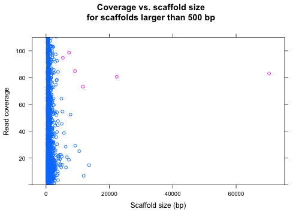
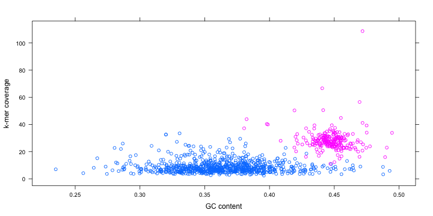
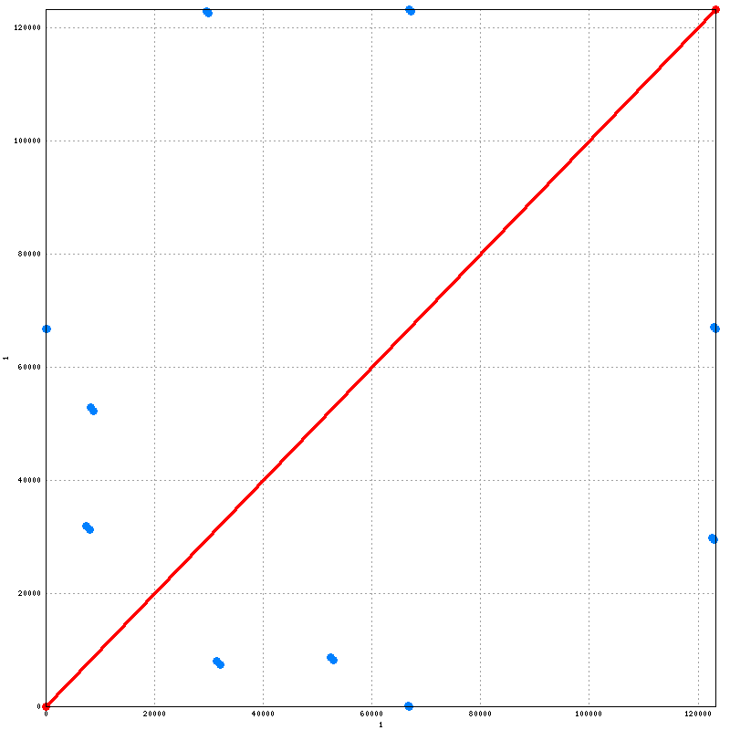

Figure S1: Classify plastid sequences
================================================================================

[Figure S1]: #figure-s1-classify-plastid-sequences



**Figure S1**: Six plastid sequences were separated by length and
depth of coverage using thresholds chosen by inspection

Figure S2: Classify mitochondrial sequences
================================================================================

[Figure S2]: #figure-s2-classify-mitochondrial-sequences



**Figure S2**: Mitochondrial sequences were separated by length, depth
of coverage and GC content using k-means clustering in R

Figure S3: MUMmer alignment of the plastid
================================================================================

[Figure S3]: #figure-s3-mummer-alignment-of-the-plastid



**Figure S3**: MUMmer was used to identify the inverted repeat of the plastid

Table S1: Software
================================================================================

[Table S1]: #table-s1-software

Software      | Version | DOI
--------------|---------|--------------------------
ABySS         | 1.3.7   | [10.1101/gr.089532.108][]
ARAGORN       | 1.2.36  | [10.1093/nar/gkh152][]
BEDTools      | 2.24.0  | [10.1093/bioinformatics/btq033][]
Biopython     | 1.65    | [10.1093/bioinformatics/btp163][]
BLAST         | 2.2.30  | [10.1016/S0022-2836(05)80360-2][]
BWA           | 0.7.12  | [10.1093/bioinformatics/btp324][]
Barrnap       | 0.5     | NA
DOGMA         | NA      | [10.1093/bioinformatics/bth352][]
Exonerate     | 2.2.0   | [10.1186/1471-2105-6-31][]
GenomeTools   | 1.5.5   | [10.1109/TCBB.2013.68][]
HMMER         | 3.1b2   | [10.1371/journal.pcbi.1002195][]
MAKER         | 2.31.8  | [10.1104/pp.113.230144][]
MUMmer        | 3.23    | [10.1186/gb-2004-5-2-r12][]
OGDraw        | 1.1.1   | [10.1093/nar/gkt289][]
Prodigal      | 2.6.2   | [10.1186/1471-2105-11-119][]
Prokka        | 1.11    | [10.1093/bioinformatics/btu153][]
QUAST         | 2.3     | [10.1093/bioinformatics/btt086][]
RECON         | 1.0.7   | [10.1101/gr.88502][]
RMBlast       | 2.2.28  | NA
RepeatMasker  | 4.0.5   | NA
RepeatModeler | 1.0.8   | NA
RepeatScout   | 1.0.5   | [10.1093/bioinformatics/bti1018][]
RNAmmer       | 1.2     | [10.1093/nar/gkm160][]
Salmon        | 0.4.2   | [10.1038/nbt.2862][]
SAMtools      | 1.2     | [10.1093/bioinformatics/btp352][]
TRF           | 4.07b   | [10.1093/nar/27.2.573][]
tRNAscan-SE   | 1.23    | [10.1093/nar/25.5.0955][]

[10.1016/S0022-2836(05)80360-2]: http://dx.doi.org/10.1016/S0022-2836(05)80360-2
[10.1038/nbt.2862]: http://dx.doi.org/10.1038/nbt.2862
[10.1093/bioinformatics/bth352]: http://dx.doi.org/10.1093/bioinformatics/bth352
[10.1093/bioinformatics/bti1018]: http://dx.doi.org/10.1093/bioinformatics/bti1018
[10.1093/bioinformatics/btp163]: http://dx.doi.org/10.1093/bioinformatics/btp163
[10.1093/bioinformatics/btp324]: http://dx.doi.org/10.1093/bioinformatics/btp324
[10.1093/bioinformatics/btp352]: http://dx.doi.org/10.1093/bioinformatics/btp352
[10.1093/bioinformatics/btq033]: http://dx.doi.org/10.1093/bioinformatics/btq033
[10.1093/bioinformatics/btt086]: http://dx.doi.org/10.1093/bioinformatics/btt086
[10.1093/bioinformatics/btu153]: http://dx.doi.org/10.1093/bioinformatics/btu153
[10.1093/nar/25.5.0955]: http://dx.doi.org/10.1093/nar/25.5.0955
[10.1093/nar/27.2.573]: http://dx.doi.org/10.1093/nar/27.2.573
[10.1093/nar/gkh152]: htpp://dx.doi.org/10.1093/nar/gkh152
[10.1093/nar/gkm160]: http://dx.doi.org/10.1093/nar/gkm160
[10.1093/nar/gkt289]: http://dx.doi.org/10.1093/nar/gkt289
[10.1101/gr.089532.108]: http://dx.doi.org/10.1101/gr.089532.108
[10.1101/gr.88502]: http://dx.doi.org/10.1101/gr.88502
[10.1104/pp.113.230144]: http://dx.doi.org/10.1104/pp.113.230144
[10.1109/TCBB.2013.68]: http://dx.doi.org/10.1109/TCBB.2013.68
[10.1186/1471-2105-11-119]: http://dx.doi.org/10.1186/1471-2105-11-119
[10.1186/1471-2105-6-31]: http://dx.doi.org/10.1186/1471-2105-6-31
[10.1186/gb-2004-5-2-r12]: http://dx.doi.org/10.1186/gb-2004-5-2-r12
[10.1371/journal.pcbi.1002195]: http://dx.doi.org/10.1371/journal.pcbi.1002195

Table S1b: Data
================================================================================

Identifier    | Citation               | Name
--------------|------------------------|--------------------
[NC_010303][] | @chaw2008mitochondrial | Cycas taitungensis mitochondrion, complete genome
[NC_021456][] | @nystedt2013norway     | Picea abies chloroplast complete genome

[NC_010303]: http://www.ncbi.nlm.nih.gov/nuccore/NC_010303
[NC_021456]: http://www.ncbi.nlm.nih.gov/nuccore/NC_021456

Table S2: Plastid MAKER parameters
================================================================================

[Table S2]: #table-s2-plastid-maker-parameters

```bash
#-----Genome (these are always required)
genome=pg29-plastid.fa #genome sequence (fasta file or fasta embeded in GFF3 file)
organism_type=eukaryotic #eukaryotic or prokaryotic. Default is eukaryotic

#-----EST Evidence (for best results provide a file for at least one)
est=NC_021456.frn #set of ESTs or assembled mRNA-seq in fasta format

#-----Protein Homology Evidence (for best results provide a file for at least one)
protein=cds_aa.fa #protein sequence file in fasta format (i.e. from mutiple oransisms)

#-----Repeat Masking (leave values blank to skip repeat masking)
model_org=
repeat_protein=

#-----Gene Prediction
est2genome=1 #infer gene predictions directly from ESTs, 1 = yes, 0 = no
protein2genome=1 #infer predictions from protein homology, 1 = yes, 0 = no

#-----MAKER Behavior Options
est_forward=1 #map names and attributes forward from EST evidence, 1 = yes, 0 = no
single_exon=1 #consider single exon EST evidence when generating annotations, 1 = yes, 0 = no
single_length=50 #min length required for single exon ESTs if 'single_exon is enabled'
```

Table S3: Mitochondrion MAKER parameters
================================================================================

[Table S3]: #table-s3-mitochondrion-maker-parameters

```bash
genome=pg29mt-scaffolds.fa
organism_type=eukaryotic
protein=cds_aa.fa
model_org=picea
rmlib=rmlib.fa
repeat_protein=/usr/local/opt/maker/libexec/data/te_proteins.fasta
protein2genome=1
est_forward=1
single_exon=1
```

References
================================================================================
