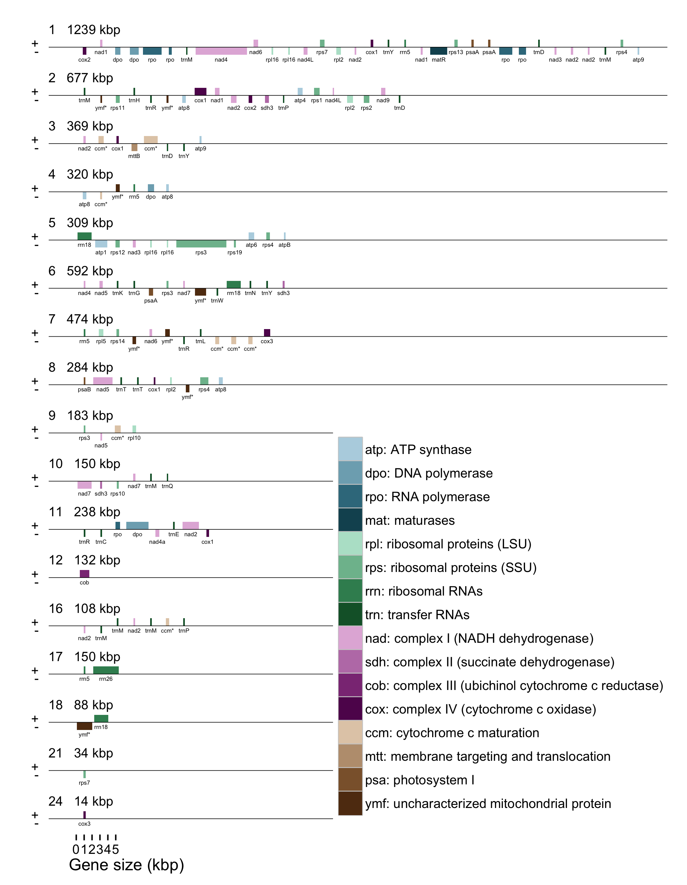
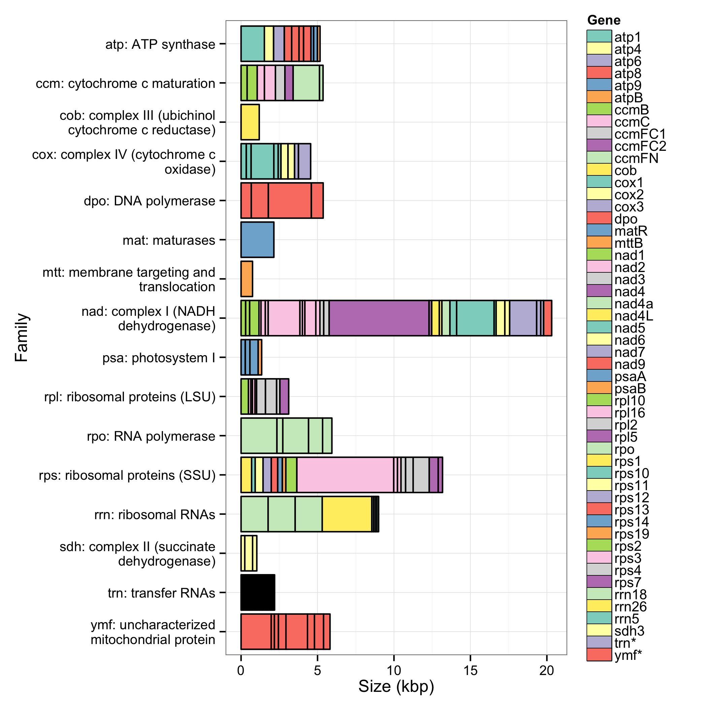
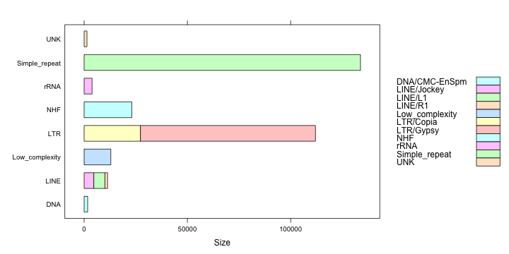

Introduction
================================================================================

Most plant cells contain two types of organelles that harbour their own genomes, mitochondria and plastids. In the *Pinaceae*, mitochondrial genomes are inherited maternally, and plastid genomes are inherited paternally [@whittle2002male].

Complete plastid genomes of the gymnosperms Norway spruce (*Picea abies*) [@nystedt2013norway], *Podocarpus lambertii* [@do2014complete], *Taxus chinensis* var. *mairei* [@zhang2014complete] and four *Juniperus* species [@guo2014predominant] have recently been published in NCBI Genbank [@benson2014genbank]. These projects used a variety of strategies for isolating cpDNA, using physical separation methods in the lab or computationally separating cpDNA sequences from nuclear sequences, sequencing and assembly, shown in Table\ xx.

The *Picea abies* genome used 454 GS FLX Titanium sequencing and Sanger sequencing of PCR amplicons for finishing, BLAST [@altschul1990basic] to isolate the cpDNA reads, and the software Newbler to assemble the reads. The *P. lambertii* genome assembly isolated the cpDNA using the saline Percoll gradient protocol of @do2014improved, Illumina MiSeq sequencing and the software Newbler to assemble the reads. The *Juniperus bermudiana* genome assembly used long-range PCR to amplify the plastid DNA, a combination of Illumina GAII and Sanger sequencing, and the software Geneious to assemble the reads using *C. japonica* as a reference genome. The other three *Juniperus* genome assemblies used Illumina MiSeq sequencing and the software Velvet [@zerbino2008velvet] to assemble the reads. The *T. chinensis* genome assembly used whole-genome Illumina HiSeq 2000 sequencing, BLAT [@kent2002blat] to isolate the cpDNA reads and SOAPdenovo [@luo2012soapdenovo2] to assemble the isolated cpDNA reads. All of these projects used DOGMA [@wyman2004automatic] to annotate the assembly.

| Species                | cpDNA Separation        | Sequencing               | Assembler software |
|------------------------|-------------------------|--------------------------|--------------------|
| *Picea abies*          | BLAST *in silico*       | 454 GS FLX Titanium ^a^  | Newbler            |
| *Podocarpus lambertii* | Saline Percoll gradient | Illumina MiSeq           | Newbler            |
| *Juniperus bermudiana* | Longer-range PCR        | Illumina GAII ^a^        | Geneious           |
| Other *Juniperus*      | Unspecified             | Illumina MiSeq           | Velvet             |
| *Taxus chinensis*      | BLAT *in silico*        | Illumina HiSeq 2000      | SOAPdenovo         |

Table: Table xx: Methods of cpDNA separation, sequencing and assembly of complete plastid genomes of gymnosperms published. ^a^ Finished with PCR and Sanger sequencing

Only one complete mitochondrial genome of a gymnosperm has been published, *Cycas taitungensis* [@chaw2008mitochondrial], while complete mitochondrial genome sequences of the angiosperms *Brassica maritima* [@grewe2014comparative], *Brassica oleracea* (*ibid.*), *Capsicum annuum* [@jo2014extensive], *Eruca sativa* [@wang2014complete], *Helianthus tuberosus* [@bock2014genome], *Raphanus sativus* [@jeong2014complete], *Rhazya stricta* [@park2014complete] and *Vaccinium macrocarpon* [@fajardo2014american] have been published in NCBI Genbank. Six of these projects gave details of the sample preparation, sequencing, assembly and annotation strategy. Three projects enriched organellar DNA using varying laboratory methods [@keren2009atnmat2; @kim2007isolation; @chen2011substoichiometrically], and the remainder used total genomic DNA. Three projects used Illumina HiSeq 2000 sequencing and Velvet for assembly, and three projects used Roche 454 GS-FLX sequencing and Newbler for assembly. Most projects used an aligner such as BLAST [@altschul1990basic] to isolate sequences with similarity to known mitochondrial sequence, either before or after assembly. Two projects used Mitofy [@alverson2010insights] to annotate the genome, and the remainder used a collection of tools such as BLAST, tRNAscan-SE [@lowe1997trnascan] and ORF Finder to annotate genes. Plant mitochondrial genomes can substantially vary in size, with some of the largest mitochondrial genomes reported for the basal angiosperm *Amborella trichopoda* [3.9 Mbp; @rice2013horizontal] and the two Silene species *S. noctiflora* and *S. conica* [6.7 Mbp and 11.3 Mbp, respectively; @sloan2012rapid].

The SMarTForests project have recently published a set of stepwise improved assemblies of the 20 gigabase white spruce (*Picea glauca*) genome [@birol2013assembling; @warren2015improved], a gymnosperm genome seven times the size of the human genome, sequenced using the Illumina HiSeq and MiSeq sequencing platforms. The whole genome sequencing data contained reads originating from both the nuclear and organellar genomes. Whereas one copy of the diploid nuclear genome is found in each cell, hundreds of organelles are present, and thus hundreds of copies of the organellar genomes. This abundance results in an overrepresentation of the organellar genomes in whole genome sequencing data.

Assembling a single lane of white spruce whole genome sequencing data using the software ABySS [@simpson2009abyss] yielded an assembly composed of organellar sequences and nuclear repeat elements. The assembled sequences that originate from the organellar genomes were separated from those of nuclear origin by classifying the sequences using their length, depth of coverage and GC content. The plastid genome of white spruce is compared to that of Norway spruce (*Picea abies*) [@nystedt2013norway], and the mitochondrial genome of white spruce is compared to that of prince sago palm (*Cycas taitungensis*) [@chaw2008mitochondrial].

Analysis of cpDNA is useful in reconstructing phylogenies of plants [@wu2007chloroplast], in determining the origin of an expanding population [@aizawa2012phylogeography] and in determining when distinct lineages of a species resulted from multiple colonization events [@jardon2011phylogeography]. These contrasting inheritance schemes of plastids and mitochondria can be useful in the characterization of species expanding their range. In the case of two previously allopatric species now found in sympatry, the mitochondrial DNA (mtDNA) is contributed by the resident species, whereas introgression of the plastid genome into the expanding species is limited, since pollen is more readily dispersed than seeds [@du2011direction]. Differential gene flow of cpDNA and mtDNA due to different methods of inheritance and dispersion results in new assemblages of organellar genomes and an increase of genetic diversity after expansion from a refugium [@gerardi2010glacial].

Material and Methods
================================================================================

DNA, RNA and software materials
------------------------------------------------------------

Genomic DNA was collected from the apical shoot tissues of a single interior white spruce tree, clone PG29, and sequencing libraries constructed as described in @birol2013assembling. Because the original intention of this sequencing project was to assemble the nuclear genome, an organelle exclusion method was used to preferentially extract nuclear DNA. Sequencing reads from both organellar genomes were present in sufficient depth however to assemble their genomes.

RNA was extracted from eight samples, three developmental stages and five mature tissues: megagametophyte, embryo, seedling, young buds, xylem, mature needles, flushing buds and bark, described in @warren2015improved. These samples were sequenced with the Illumina HiSeq 2000 [@warren2015improved]. The RNA-seq data was used to quantify the transcript abundance of the annotated mitochondrial genes using the software Salmon [@patro2014sailfish].

The software used in this analysis and their versions are listed in supplementary Table S1.

Methods used to assemble the plastid genome
------------------------------------------------------------

Paired-end sequencing usually leaves a gap of unsequenced nucleotides in the middle of the DNA fragment. Because 300 bp paired-end reads were sequenced from a library of 500 bp DNA fragments, the reads are expected to overlap by 100 bp. These overlapping paired-end reads were merged using ABySS-mergepairs, a component of the software ABySS [@simpson2009abyss]. These merged reads were assembled using ABySS. Contigs that are putatively derived from the plastid were separated by length and depth of coverage using thresholds chosen by inspection of a scatter plot (see supplementary Figure S1). These putative plastid contigs were assembled into scaffolds using ABySS-scaffold.

We ran the gap-filling application Sealer (Paulino et al., in review; options `-v -j 12 -b 30G -B 300 -F 700` with `-k` from 18 to 108 with step size 6) on the ABySS assembly of the plastid genome, closing 5 of the remaining 7 gaps, with a resulting assembly consisting of two large (\~50 and \~70 kbp) scaftigs. Given the small size of the plastid genome, we opted to manually finish the assembly using the software Consed 20.0 [@gordon2013consed]. Briefly, we loaded the resulting gap-filled assembly into Consed and imported Pacific Biosciences (PacBio) (**data description NEEDED XX**) 9204 reads 500 bp and larger into the assembly and aligned them to the plastid genome using cross\_match [@green1999documentation] from within Consed. For each scaftig end, 6 PacBio reads were pulled out and assembled using the mini-assembly feature in Consed. Cross\_match alignments of the resulting contigs to the plastid assembly were used to merge the two scaftigs and confirm that the complete circular genome sequence was obtained. In a subsequent step, 7,742 Illumina HiSeq reads were imported and aligned to the assembly using Consed. These reads were selected from the library of 133 million reads used to assemble the mitochondrion on the basis of alignment to our draft plastid genome using BWA 0.7.5a [@li2013aligning], focusing on regions that would benefit from read import by restricting our search to regions with ambiguity and regions covered by PacBio reads exclusively. The subset of Illumina reads were selected using samtools 0.1.18, mini-assembled with Phrap [@green1999documentation] and the resulting contigs re-merged to correct bases in gaps filled only by PacBio, namely one gap and sequence at edges confirming the circular topology. The starting base was chosen using the Norway spruce plastid genome sequence [NC_021456, @nystedt2013norway]. Our assembly was further polished using the Genome Analysis Toolkit (GATK) 2.8-1-g932cd3a FastaAlternateReferenceMaker [@mckenna2010genome].

The assembled plastid genome was initially annotated using DOGMA [@wyman2004automatic]. Being an interactive web application, it is not convenient for automated annotation. The software MAKER [@campbell2014maker] is not interactive and is designed for automated annotation, and we used it to annotate the white spruce plastid using the Norway spruce plastid genome [NC_021456, @nystedt2013norway] for both protein-coding and non-coding gene homology evidence. The parameters of MAKER are show in supplementary Table S2. The inverted repeat was identified using MUMmer [@kurtz2004versatile], shown in supplementary Figure S3.

The assembled plastid genome was aligned to the Norway spruce plastid using BWA-MEM [@li2013aligning]. Coverage and identity of these alignments were calculated using the script `samskrit-identity` (<https://github.com/sjackman/samskrit>). The two genomes were compared using QUAST [@gurevich2013quast] to confirm the presence of the annotated genes of the Norway spruce plastid in the white spruce plastid.

Methods used to assemble the mitochondrial genome
------------------------------------------------------------

ABySS-Konnector [@vandervalk2014konnector] was used to fill the gap between the paired-end reads of a single lane of Illumina HiSeq sequencing of a paired-end library. These connected paired-end reads were assembled using ABySS. Putative mitochondrial sequences were separated from nuclear sequences by their length, depth of coverage and GC content using k-means clustering in R (see supplementary Figure S2). The putative mitochondrial contigs were then assembled into scaffolds using ABySS-scaffold with a single lane of Illumina HiSeq sequencing of a mate-pair library.

The ABySS assembly of the white spruce mitochondrial genome resulted in 71 scaffolds. We ran the gap-filling application Sealer attempting to close the gaps between every combination of two scaffolds. This approach closed 10 gaps and yielded 61 scaffolds, which we used as input to the LINKS scaffolder 1.1 [@warren2015links] (options `-k 15 -t 1 -l 3 -r 0.4`, 19 iterations with `–d` from 500 to 6000 with step size 250) in conjunction with long PacBio reads, further decreasing the number of scaffolds to 58. The Konnector pseudoreads were aligned to the 58 LINKS scaffolds with BWA 0.7.5a (`bwa mem -a multimap`), and we created links between two scaffolds when reads aligned within 1000 bp of the edges of any two scaffolds. We modified LINKS to read the resulting SAM alignment file and link scaffolds satisfying this criteria (options `LINKS-sam -e 0.9 -a 0.5`), bringing the final number of scaffolds to 38. We confirmed the merges using mate-pair reads. The white spruce mate-pair libraries used for confirmation are presented in @birol2013assembling and available from DNAnexus (SRP014489 <http://sra.dnanexus.com/studies/SRP014489>). In brief, mate-pair reads from three fragment size libraries (5, 8 and 12\ kbp) were aligned to the 38-scaffold assembly with BWA-MEM 0.7.10-r789 and the resulting alignments parsed with a PERL script. A summary of this validation is presented in supplemental Table\ S4. Automated gap-closing was performed with Sealer 1.0  (options `-j 12 -B 1000 -F 700 -P10 -k96 -k80`) using Bloom filters built from the entire white spruce PG29 read data set [@warren2015improved] and closed 55 of the 182 total gaps (30.2%). We polished the gap-filled assembly using GATK and a single HiSeq white spruce sequence lane (**XX NEEDED SRA ID**), as described for the plastid genome.

The assembled scaffolds were aligned to the NCBI nucleotide (nt) database using BLAST to check for hits to mitochondrial genomes and to screen for contamination.

The mitochondrial genome was annotated using MAKER (parameters shown in supplementary Table S3) and Prokka [@seemann2014prokka], and the two sets of annotations were merged using BEDTools [@quinlan2010bedtools] and GenomeTools [@gremme2013genometools], selecting the MAKER annotation when the two tools had overlapping annotations. The proteins of all green plants (*Viridiplantae*) with complete mitochondrial genome sequences in NCBI GenBank [@benson2014genbank], 142 species, were used for protein homology evidence, the most closely related of which is the prince sago palm (*Cycas taitungensis*) [NC_010303 @chaw2008mitochondrial], being the only gymnosperm with a complete mitochondrial genome. Transfer RNA (tRNA) were annotated using ARAGORN [@laslett2004aragorn]. Ribosomal RNA (rRNA) were annotated using RNAmmer [@lagesen2007rnammer]. Prokka uses Prodigal [@hyatt2010prodigal] to annotate open reading frames. Repeats were identified using RepeatMasker [@smit1996repeatmasker] and RepeatModeler.

The RNA-seq reads were aligned to the annotated mitochondrial genes using BWA-MEM and variants were called using samtools and bcftools requiring a minimum genotype quality of 50 to identify possible sites of C-to-U RNA editing.

Results
================================================================================

The white spruce plastid genome
------------------------------------------------------------

The assembly and annotation metrics for the plastid and mitochondrial genomes are summarized in Table\ 1. The plastid genome was assembled into a single circular contig of 123,266 bp containing 114 identified genes: 74 protein coding (mRNA) genes, 36 transfer RNA (tRNA) genes and 4 ribosomal RNA (rRNA) genes, shown in Figure 1.

Metric                          |Plastid         |Mitochondrion
------------------------------- |--------------- |-------------
Number of lanes                 |1 MiSeq lane    |1 HiSeq lane
Number of read pairs            |4.7 million     |133 million
Read length                     |300 bp          |150 bp
Number of merged reads          |3.0 million     |1.4 million
Median merged read length       |492 bp          |465 bp
Number of assembled reads       |21 thousand     |377 thousand
Proportion of organellar reads  |1/140 or 0.7%   |1/350 or 0.3%
Depth of coverage               |80x             |30x
Assembled genome size           |123,266 bp      |5.94 Mbp
Number of contigs               |1 contig        |132 contigs
Contig N50                      |123 kbp         |102 kbp
Number of scaffolds             |1 scaffold      |38 scaffolds
Scaffold N50                    |123 kbp         |369 kbp
Largest scaffold                |123 kbp         |1222 kbp
GC content                      |38.8%           |44.7%
Number of genes without ORFs    |114             |155
Protein coding genes (mRNA)     |74 (72)         |101 (50)
Ribosomal RNA genes (rRNA)      |4 (4)           |8 (3)
Transfer RNA genes (tRNA)       |36 (32)         |29 (20)
Open reading frames (ORF) $\geq$ 300 bp |NA      |1047
Coding genes containing introns |8               |5
Introns in coding genes         |9               |7
tRNA genes containing introns   |6               |0

Table: Table 1: Sequencing, assembly and annotation metrics of the white spruce organellar genomes. The number of distinct genes are shown in parentheses.

All protein-coding genes are single copy, except *psbI* and *ycf12*, which have two copies each. All tRNA genes are single copy, except *trnH-GUG*, *trnI-CAU*, *trnS-GCU* and *trnT-GGU*, which have two copies each. All rRNA genes are single copy.

The protein-coding genes
*atpF*, *petB*, *petD*, *rpl2*, *rpl16*, *rpoC1* and *rps12*
each contain one intron, and *ycf3* contains two introns.
The tRNA genes
*trnA-UGC*, *trnG-GCC*, *trnI-GAU*, *trnK-UUU*, *trnL-UAA* and *trnV-UAC*
each contain one intron.
Of the 15 introns, 11 are determined to be group II introns by RNAweasel [@lang2007mitochondrial].

The first and smallest exons of the genes *petB*, *petD* and *rpl16* are 6, 8 and 9 bp respectively. These genes likely belong to polycistronic transcripts [@barkan1988proteins] of their respective protein complexes, but the short size of their initial exons make them difficult to annotate all the same. The initial exons of these genes were added to their annotations manually.

The gene *rps12* of a plastid genome is typically trans-spliced [@hildebrand1988trans], which makes it difficult to annotate using MAKER. It is composed of three exons and one cis-spliced intron. It required manually editing the gene annotation to incorporate trans-splicing in the gene model.

Each copy of the inverted repeat (IR) is 445 bp in size, much smaller than most plants, but typical of *Pinaceae* [@lin2010comparative]. Unlike most inverted repeats, which are typically identical, the two copies differ by a single base. The IR contains a single gene, the tRNA *trnI-CAU*.

All 114 genes identified in the Norway spruce plastid genome [@nystedt2013norway] are also present in the white spruce plastid genome. The genomes of the white spruce plastid and Norway spruce plastid show perfect gene synteny with no structural rearrangements. Alignment of the white spruce genome to the Norway spruce genome using BWA-MEM [@li2013aligning] shows that 99.7% of the Norway spruce plastid genome is covered by alignments of the white spruce plastid genome, and the sequence identity in aligned regions is 99.2%.

![Figure 1: The complete plastid genome of white spruce, annotated using MAKER and plotted using OrganellarGenomeDRAW [@lohse2007organellargenomedraw].](figure/plastid-annotation.png)

The white spruce mitochondrial genome
------------------------------------------------------------

The mitochondrial genome was assembled into 38 scaffolds (132 contigs) with a scaffold N50 of 369 kbp (contig N50 of 102 kbp). The largest scaffold is 1222 kbp (Table 1). The scaffolds were aligned to the NCBI nucleotide (nt) database using BLAST. Of the 38 scaffolds, 26 scaffolds align to mitochondrial genomes, 3 small scaffolds (<10 kbp) align to *Picea glauca* mRNA clones and BAC sequences, 7 small scaffolds (<10 kbp) had no significant hits, and 2 small scaffolds (<5 kbp) align to cloning vectors. These last two scaffolds were removed from the assembly.

The mitochondrial genome contains 101 protein coding (mRNA) genes, 29 transfer RNA (tRNA) genes and 8 ribosomal RNA (rRNA) genes. The 101 protein-coding genes (50 distinct genes) compose 74 kbp (1.2%) of the genome. The 29 tRNA genes are found in 20 distinct species for 15 amino acids. The relative order of the genes on the scaffolds and gene size is shown in Figure\ 2. The size of each gene family is shown in Figure\ 3. The precise position of each gene on its scaffold is shown in supplementary Figure\ S4.

All tRNA genes are single copy, except *trnD-GUC* which has 3 copies, *trnM-CAU* which has 7 copies, and *trnY-GUA* which has 2 copies. The rRNA gene *rrn5* has 4 copies, *rrn18* has 3 copies, and *rrn26* has 1 copy.

A large number of open reading frames are identified: 5702 at least 90 bp, composing 1.3 Mbp, and 1047 at least 300 bp, composing 407 kbp. These open reading frames do not have sufficient sequence similarity to the genes of the *Viridiplantae* mitochondria used for protein homology evidence to be annotated by either MAKER or Prokka.

A total of 7 introns are found in 5 distinct protein-coding genes. The protein-coding genes *nad2*, *nad5*, and *nad7* each contain one intron, and *nad4* and *rps3* each contain two introns. All introns are determined to be group II introns by RNAweasel [@lang2007mitochondrial].

Repeats compose 390 kbp (6.6%) of the mitochondrial genome. Simple repeats and LTR Copia, ERV1 and Gypsy are the most common repeats, shown in Figure\ 4.

All 40 protein coding genes and 3 rRNA genes of the *Cycas taitungensis* mitochondrion are seen in white spruce. Of the 22 tRNA genes of *Cycas taitungensis*, 13 are found in white spruce, and 8 tRNA genes are seen in white spruce that are not seen in *Cycas taitungensis*.

The transcriptome of the white spruce mitochondrial genome
------------------------------------------------------------

The transcript abundance of the mitochondrial coding genes with known function is shown in Figure\ 5. The transcript abundance of the mitochondrial coding genes including open read frames is shown in Figure\ 6. The two developmental tissues megagametophyte and embryo have the highest abundance of coding genes and cluster together.

Of the 101 coding genes with known function, 60 are expressed in at least one of the mature tissues, 28 are expressed in one of the developing tissues but not in a mature tissue, and 13 are not found to be expressed. Of the 5702 ORFs at least 90 bp, 408 (7%) are expressed in at least one of the mature tissues, 2663 (47%) are expressed in one of the developing tissues but not in a mature tissue, and 2631 (46%) are not found to be expressed. A gene with an abundance of at least ten transcripts per million as quantified by Salmon is considered to be expressed. These results are shown in Table\ 2.

|    | Both| Mature only| Developing only| Neither|  Sum|
|:---|----:|-----------:|---------------:|-------:|----:|
|CDS |   60|           0|              28|      13|  101|
|ORF |  393|          15|            2663|    2631| 5702|
|Sum |  453|          15|            2691|    2644| 5803|

Table: Table 2: Number of expressed protein-coding genes and open reading frames tabulated by developmental stage.

Possible C-to-U RNA editing, positions where the genome sequence shows C but the RNA-seq reads shows T, is observed in 69 of 101 coding genes shown in supplementary Table\ S5, with the most highly edited gene, *nad3*, seeing nearly 9 edits per 100 bp. It can be difficult to distinguish RNA editing events from genomic SNV and miscalled variants caused by misaligned reads. We note however that over 90% (1612 of 1785) of the variants called from the RNA-seq data are C-to-T variants shown in supplementary Table\ S6, which indicates that a large fraction of these variants are due to C-to-U RNA editing. C-to-U RNA editing can create new start and stop codons, but it is not able to destroy existing start and stop codons. Editing of the ACG codon to AUG to create a cryptic start codon is frequently seen in organellar genomes [@neckermann1994role]. Four genes have cryptic ACG start codons and corroborating C-to-U RNA editing evidence in the RNA-seq data: *mttB*, *nad1*, *rps3* and *rps4*.

Conclusion
================================================================================

One lane of MiSeq sequencing of whole genome DNA is sufficient to assemble the 123 kbp complete plastid genome, and one lane of HiSeq sequencing of whole genome DNA is sufficient to assemble a draft 5.9 Mbp mitochondrial genome of white spruce. Scaffold contiguity is improved with additional mate-pair library sequencing. The resulting assembly of whole genome sequencing data is composed of organellar sequences as well as high-copy-number nuclear repeat elements. The mitochondrial sequences are separated using a k-means classifier based on their length, depth of coverage and GC content of the sequences.

The white spruce plastid genome shows no structural rearrangements when compared with Norway spruce. All protein coding and rRNA genes of the prince sago palm (*Cycas taitungensis*) mitochondrion are present in the white spruce mitochondrion.

The protein coding gene content of the mitochondrial genome is quite sparse, with 101 protein coding genes in 5.9 Mbp, in comparison to the plastid genome, with 74 protein coding genes in 123 kbp. Nearly 7% of the mitochondrial genome is composed of repeats, and roughly 1% is composed of coding genes. A significant portion, over 90%, of the unusually large size of the white spruce mitochondrial genome is yet unexplained.

Acknowledgements
================================================================================

Shaun Jackman would like to thank his supervisors Inanc Birol and Joerg Bohlmann for their guidance in the preparation of this manuscript, and Carson Holt for being exceedingly responsive and helpful in tweaking MAKER.

References
================================================================================
